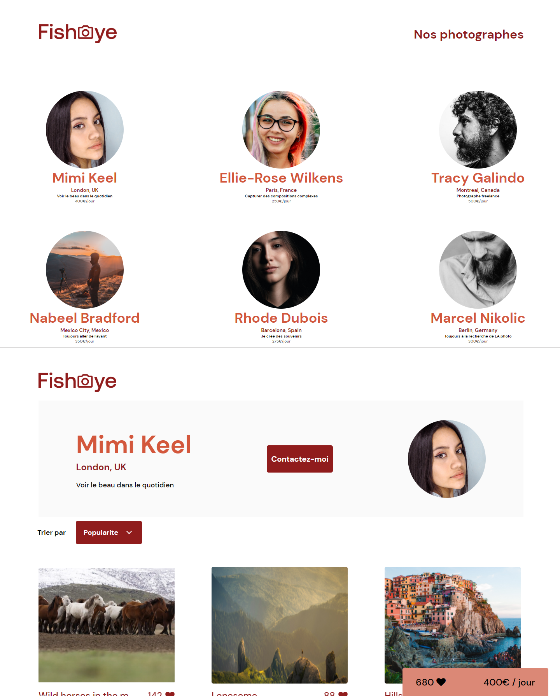

# Fisheye-OCR

Project de formation chez OpenClassRoom.

Langage solicité:

- HTML
- CSS
- SASS
- JAVASCRIPT

# Objectif

- Maitrise site dynamique
- Communication avec API
- Site optimiser pour l'accessibilité
-Vérification code par eslintrc

# Maquette

[Canevas]([https://www.figma.com/file/bAnXDNqRKCRRP8mY2gcb5p/UI-Design?node-id=4%3A1](https://www.figma.com/file/Q3yNeD7WTK9QHDldg9vaRl/UI-Design-FishEye-FR?type=design&node-id=0-1&mode=design&t=Ylrj7HgFZ5TDS0hp-0))

# Visiter

[Voir le Rendu](https://nerion-1337.github.io/Fisheye-OCR/)

# Version BACK-END - SQL

[Découvrir](https://github.com/Nerion-1337/Fisheye-OCR/tree/SQL)

# Aperçu

