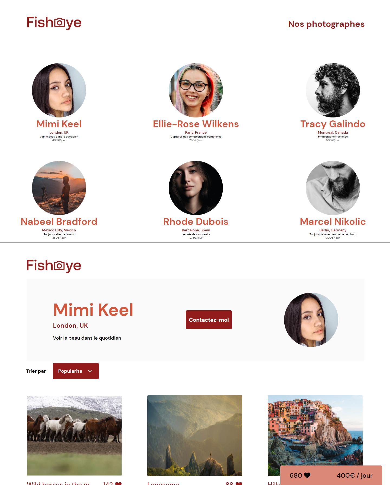

# Fisheye-OCR

Project de formation chez OpenClassRoom.

Langage solicité:

- HTML
- CSS
- SASS
_ JAVASCRIPT

# Objectif

- Maitrise site dynamique grâce à des datas (json ici).
- Site optimiser pour l'accessibilité
- 

