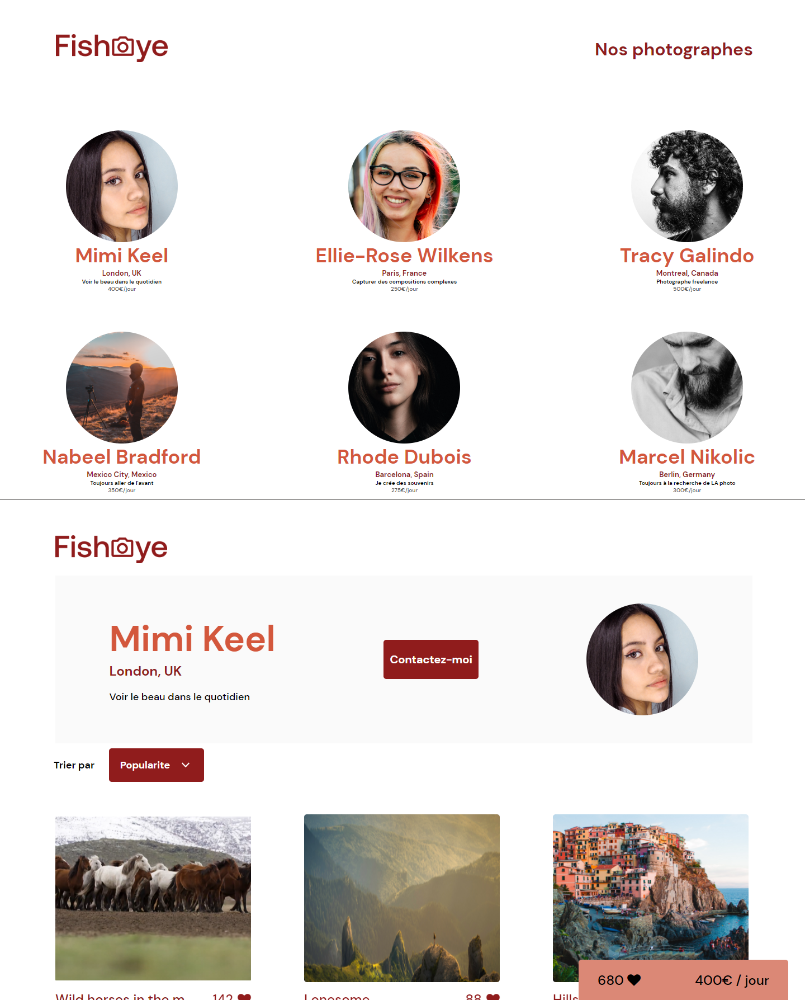

# Fisheye-OCR

Project de formation chez OpenClassRoom.

Langage solicité:

- HTML
- CSS
- SASS
- JAVASCRIPT

# Objectif

- Maitrise site dynamiqu
- Communication avec API
- Site optimiser pour l'accessibilité

# Maquette

[Canevas](https://www.figma.com/file/Q3yNeD7WTK9QHDldg9vaRl/UI-Design-FishEye-FR?node-id=0%3A1)

# Visiter

[Voir le Rendu](https://nerion-1337.github.io/Fisheye-OCR/)

# Version BACK-END - SQL

[Découvrir](https://github.com/Nerion-1337/Fisheye-OCR/tree/SQL)

# Aperçu

